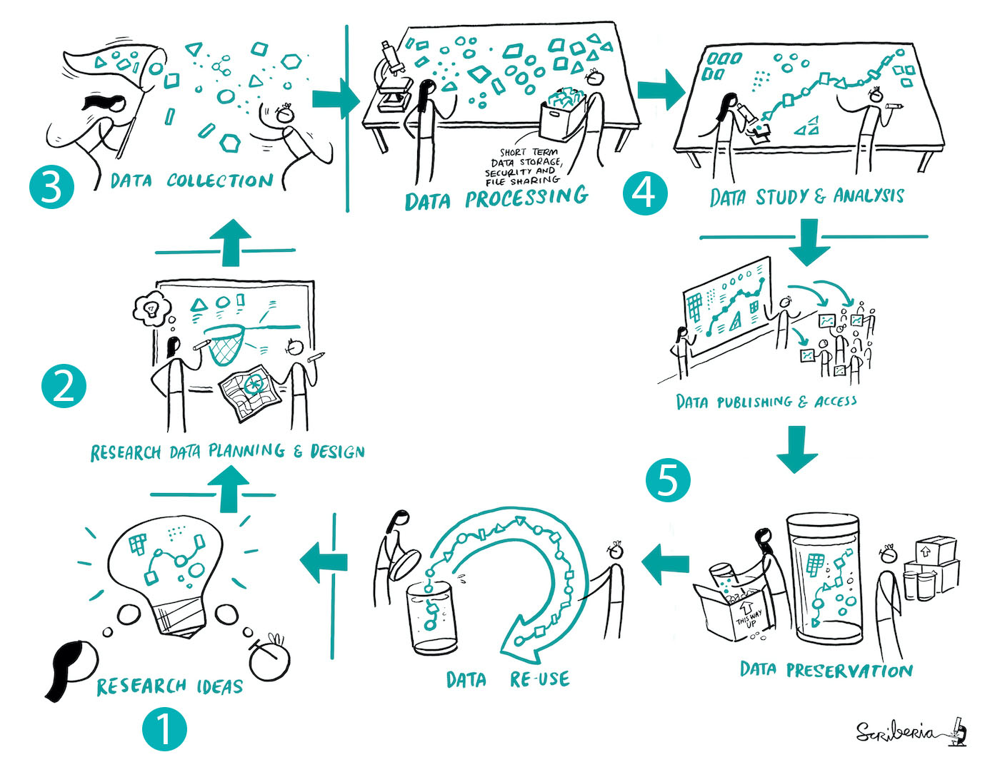

# RDM in the Research Project Cycle

 ## What is Research Data Management? 
 :::{card} 
"Research Data Management (RDM) is a broad term that covers all aspects of handling research data throughout research, including planning, collecting, organising, documenting, storing, preserving, and sharing data. Effective RDM also covers the management of all resources involved in working with research data such as files, scripts [and tools]" (Li et al., 2025).  
::: 
<br>

## The Research Project Cycle

From start to finish, your thesis project will likely involve 5 key stages, as shown in this graphic for a typical research project cycle:  

<center>

<p style="font-size: x-small;"><em>Adapted from "Project Cycle" by Scriberia, The Turing Way Community, licensed under CC-BY-4.0.</em></p>
</center>


A **data management plan** maps out in advance what you intend to do with research data during each part of the project cycle. This mini-module will guide you through key questions and considerations for managing research data effectively at each stage of the research process. 
<br>

## Download this template! 

Before you continue on in the mini-module, download this RDM checklist: 
:::{card} 
[**Download the Checklist**](graphics/Checklist_v1.pdf).
:::
The checklist template is meant to accompany the mini-module so that you can apply the guiding questions to plan your own project. We suggest that you print it out, jot notes in the margins, and bring it to planning discussions with your thesis supervisor. 

## Why plan for RDM? 

Let's illustrate why planning for research data management is essential by looking at four examples of researchers who did not effectively manage the data for their projects:  

::::{card-carousel} 2
:::{card} Scenario 1: No backups  
Emma spent months collecting data for her thesis on marine biodiversity [around off-shore wind farms]. Hundreds of hours went into snorkeling trips, labeling samples, and inputting data into Excel. She kept everything on her laptop. One rainy evening, her laptop wouldn’t turn on. No backup. No cloud sync. Just the sound of her academic dreams slowly drowning. 
:::
:::{card}  Scenario 2: Missing documentation 
Carlos did everything right, or so he thought. He conducted experiments, organized his folders, and saved everything on the university network. But when his advisor asked for the specific settings used for the analysis, such as the settings on the mass spectrometer he used to identify the peptides from [a collection of biological samples], Carlos realized he hadn’t documented anything. Worse, he couldn’t remember if he used the same setup for all experiments.   
:::
:::{card}  Scenario 3: Redundant file naming  
Alina had over 20 versions of [the] final dataset [for her thesis project], each slightly different. She named them things like Final.csv, FinalReal.csv, Final_FIXED.csv, And USE_THIS_ONE_final2.csv. 

During a meeting, her supervisor questioned her statistical analysis. Alina tried to trace it back but couldn’t figure out which dataset she [had used to write her final report].  
:::
:::{card} Scenario 4: Late ethics application 
For his master's thesis, Michel plans to look at people's experiences in a flight simulator. He will collect data on each participant's heart rate and temperature before and during the simulation. He will also ask participants to fill out a survey after their experiences in the simulator. Michel mistakenly thinks that his project doesn't involve personal data. But he is, indeed, planning to collect personal data that can be traced back to individual people. This requires ethical approval from TU Delft's Human Research Ethics Committee (the HREC)! 

Michel has taken time to recruit participants, booked precious time in the simulator, and gotten the software all set up. But he then learns that HREC must approve his research *before* he can proceed with data collection. He rushed to complete the HREC application materials, then has to wait several weeks for the committee's decision. This causes delays in data collection. Michel isn't sure if he'll get his project finished in time. 
:::
::::
<p style="font-size: x-small;"><em>Scenarios #1-3 re-used and adapted from: Li, M., Marcoux, K., Nazareth, D., Nikuze, A., & Plomp, W. (2025, December). Research Data Management Guidebook for Students. Zenodo. <a href="https://doi.org/10.5281/zenodo.15576176" target="_blank"> https://doi.org/10.5281/zenodo.15576176</a></em></p>
<br>

## Benefits of RDM 
In this mini-module we hope to reinforce the knowledge and skills that are required to prevent research setbacks like the four scenarios just described. As these examples demonstrate, there are good reasons to develop a strong data management plan and to internalize habits of planning for research data management. The benefits for you include:   

- **increased efficiency** by mapping how you will organise, document and store the data for your project (kind of like getting all your ingredients and tools out before you start to cook something).  

- **avoiding complications and delays** that stem from issues like data loss, inconsistent documentation, redundant file naming, and missing approvals.  

- making your **research methods more transparent**, making it easier for others to **re-use or reproduce** and verify your findings.  

- making your research more **FAIR** (Findable, Accessible, Interoperable and Reusable). In other words, it makes your research reproducible by others (including yourself!). Published research that adheres to FAIR principles is cited more and has a higher impact score (Alves, 2024). 

- developing **project planning and management skills** that will benefit you in academia or the workforce.  

- **saving you time and reducing stress** during your thesis project, especially at the end when good RDM will make it easier to write your report: by getting organised at the beginning of your project, you will save time at the end. 
<br>

## The Research Project Cycle: Check your understanding

Check your understanding of key ideas for RDM in the Research Project Cycle by answering these quiz questions: 
```{h5p} https://tudelft.h5p.com/content/1292947760806373647
```
<br> 
