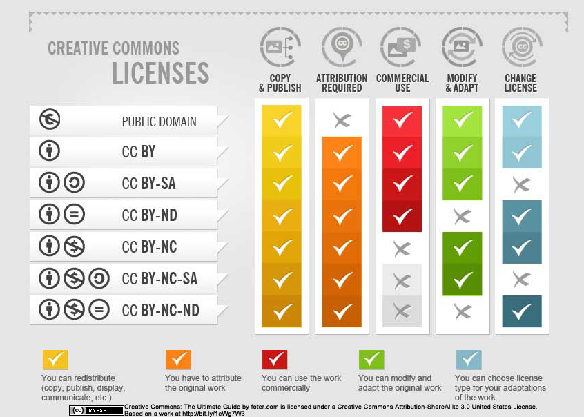

# Stage I: Planning for Research Ideas 

## *Key question: What data are needed to test my hypothesis and answer my research question(s)?* 

During your research project, you will collect or re-use a variety of **research objects**, which are all the materials involved in conducting, understanding, verifying and reproducing research. The more specific you are about which research objects are needed to effectively answer your research question(s) and support your research process, the clearer you can design for collecting and organising these objects. One of the key research objects you will gather is **research data**: information to support research findings. Examples of research data include:   

- Field notes
- Quantitative and qualitative observations
- Samples from wet and dry labs
- Geospatial and satellite data
- Genomic sequences
- Social media and consumer data
- Survey and Interview data
- Video footage
- Microscopy images
- Text corpora
- Digital and physical models
- Simulation data and code
- Sound recordings & transcripts
- Maps
- Sensor data
- Data re-used from open repositories
<br>
<br>
As additional research objects, you may generate or re-use **code, scripts, and software.**  

Depending on your project, you also need to collect additional research objects such as **supporting or administrative artefacts**. For example:  

- Informed consent letters that research participants sign to take part in a research project 
- An annotated bibliography
- A budget for the project
- An interview or survey template
- Approval forms
- Documentation of research methods

<br>

## *Key question: Do the data carry special ethical or legal implications?* 

During the planning phase of your project you should consider whether you will be working with **personal data**, **data protected by copyright**, and/or **proprietary data** trademarked by a company. These types of research data flag increased risk, carry legal restrictions, and/or require ethical or legal approval. Your project timeline needs to allow ample time for the approvals process. Otherwise, you might need to adjust your project design to fit your timeline.  By determining whether you'll be handling these types of data, you can plan and prepare accordingly.  

### PERSONAL DATA 
Are you conducting interviews or surveys with human participants, re-using data from social media, re-using medical images from humans, or collecting or re-using any other data originating from people? If so, your project will likely involve personal data. **Personal data are defined as any information that can be used to directly or indirectly identify a person.** You have an ethical obligation to handle this type of data with great care and to protect the privacy of your human research subjects.  

Projects that involve personal data require careful planning since you must adhere to specific guidelines before collecting or re-using personal data: 

- TU Delft MSc projects must apply for and receive approval from the TU Delft Human Research Ethics Committee (HREC) before starting any research involving human participants.  

- If you are planning to collect data from people, you must very clearly inform your research participants about the potential risks involved and obtain their consent.  

- It's recommended that you plan out how you will process the raw personal data in advance. Once collected, any personal data should be anonymised and/or pseudonymised as soon as possible.
::::{grid} 2
:::{grid-item-card} Anonymisation 
**Anonymisation** involves removing all identifying characteristics from the data so that it can no longer be used to re-identify individual study participants. Anonymisation is **irreversible**. 
:::
:::{grid-item-card} Pseudonymisation
**Pseudonymisation** involves replacing identifying information with codes or pseudonyms, and keeping track of the codes using a key file or linkage file (which should be stored separately from the raw data in an encrypted or password-protected file). Pseudonymisation is **reversible with the key**.
:::
::::

We are not able to go into great detail about procedures for handling personal data in this mini-module about research data management. For more information about working with personal data and the documents required for the HREC application, we encourage you to visit the mini-module  <a href="https://tu-delft-library.github.io/MSc-Planning-for-Personal-Data/main/introduction/introduction.html" target="_blank"> MSc Planning for Personal Data</a>. 

For a detailed explanation about anonymisation and pseudonymisation procedures, we recommend you visit this page by the <a href="https://www.fsd.tuni.fi/en/services/data-management-guidelines/anonymisation-and-identifiers/" target="_blank"> Finnish Social Science Data Archive</a>. 

### COPYRIGHTED DATA (INTELLECTUAL PROPERTY) 
Are you planning to re-use data generated by other people, such as tabular data, code, software, images, film clips, etc.? If yes, you need to be aware of possible legal or copyright issues. As Janine Strandberg, data steward in the Faculty of Architecture, puts it: “If the data were created by someone else, you should already be asking questions!”  

Examples of Re-used data include:  

- photos that somebody else took 

- code that someone else wrote that you found in GitHub 

- schematics of buildings that someone else designed 

- films that someone else produced 

- datasets that someone else collected    

Some data are marked with a Creative Commons (CC) designation. This indicates that the data can be re-used as long as you follow the rules for the specific CC license. For example, “CC-BY” indicates that a source can be re-used as long as you attribute the original creators. This graphic gives a full overview of possible CC licenses:  

<center>

<p style="font-size: x-small;"><em>.“Creative Commons: The Ultimate Guide” by foter.com is licensed under CC-BY-SA </em></p>
</center>


Please note: **CC licensing does not apply to software.** To learn in more detail about interpreting software licenses, visit: Schlauch, Tobias - <a href="https://zenodo.org/records/8246557" target="_blank"> “All you need to know about Software Licenses as a RSE”</a>. Another helpful resource is the <a href="https://tu-delft-dcc.github.io/docs/software/documentation/license.html" target="_blank"> DCC guide on software licenses</a>. 

While some data have a CC license, other data are protected by copyright. To learn more about the extent to which you can use copyrighted data, visit the TU Delft Library’s Copyright website: <a href="https://www.tudelft.nl/library/support/copyright/student-copyright-answers#c1118763" target="_blank"> As a student, I want to re-use data in my multimedia/data/student paper, thesis, etc.</a>  

If the data are not explicitly marked with a CC license, or if you see no copyright symbol at all, you should assume that the data are protected by copyright.

### PROPRIETARY DATA 
Are you doing an internship with a company and (re-)using the company's data? Then your project may involve proprietary data. This means the company or organization owns and controls the data. There may be limitations to how you work with and share the data.   

- Look at the terms of your graduation agreement (also referred to as a user agreement). A graduation agreement usually specifies who owns the data, with exactly whom/where they can be shared and stored.  

- Do you have questions about proprietary data? We encourage you to seek advice from your thesis supervisor. Your supervisor may refer you onwards to your faculty’s contract manager(s) or to a data steward (the procedures in each faculty differ.)    
- For more information about working with proprietary data, TU Delft students can also access the <a href="https://www.tudelft.nl/en/student/my-study-me/rules-guidelines-and-participation/intellectual-property" target="_blank"> intellectual property webpage</a> in the student portal.  
<br> 

## Stage 1: Check your understanding 
Check your understanding of key ideas in Stage 1: Planning for Research Ideas by answering these quiz questions: 
<br>
```{h5p} https://tudelft.h5p.com/content/1292947761301471687
```
<br>
 


