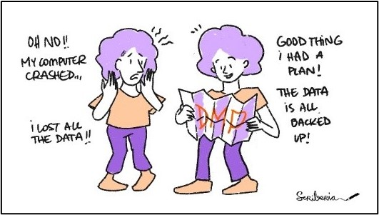

# Stage 2: Planning for Research Data & Design 

## *Key question: Where will the data be stored?* 

By intentionally planning for storage, you can safeguard your research project against data disasters.   
<br>
<center>

<p style="font-size: x-small;"><em>"Data Management Plan" by Scriberia, <a href="http://doi.org/10.5281/zenodo.3332807" target="_blank"> The Turing Way Community </a> is licensed under <a href="http://creativecommons.org/licenses/by/4.0" target="_blank"> CC BY 4.0</a></em></p>
</center>
<br>

### Storage criteria

Secure storage protects you against data loss and protects the research data from security breaches or leaks. When you choose a storage solution, you should ask: 

- Is the storage platform appropriate to the **size or volume of the data** that you plan to collect? For example, you'll need to pay attention to storage space if you are working with collections of high- speed video files.  

- Does the storage platform match the **degree of sensitivity** of the data (e.g. personal data)? 

- If you are working with proprietary data, where are you **permitted** to store the data? (The graduation agreement/user agreement will specify.)  

- Does the storage platform store data **within the EU**? (It is strongly recommended.)  

- Will you need to share the data with **collaborators** during your project?  

We recommend that you discuss where the data should be saved with your thesis supervisor during the planning phase of your thesis project. No matter which storage solution you use, you need to share the folder with your supervisor. 
<br>

### Storage solutions for MSc students at TU Delft:

This is an overview of recommended storage platforms for master’s students at TU Delft. Here, we will give a short description of key features, plus links to more detailed information:    

::::{tab-set}

:::{tab-item} OneDrive 
- OneDrive folders containing the research data for your project should be shared with your supervisor(s). 

- You can set up a desktop version of OneDrive to back up the files on your device.     

- Your OneDrive storage will be deleted once you are no longer part of TU Delft, make sure you transfer the data that you or your supervisor wants to keep at the end of the project, otherwise it will be deleted.
  
- <a href="https://storagefinder.tudelft.nl/package/6/" target="_blank"> Learn more about OneDrive storage at TU Delft.</a>
:::

:::{tab-item} Microsoft Teams
- Teams files are stored on 'Sharepoint', and can sync with OneDrive 

- Teams can be an option for collaborative projects (unless the data are sensitive), but you need to be aware of which sharing permissions are enabled for Teams folders:  

- If the creator of a folder has allowed anyone to access it, that could lead to a data breach.  

- If the creator of a folder has allowed universal or public editing rights, your data could accidentally get erased or deleted.    

- Your Sharepoint storage will be deleted once you are no longer part of TU Delft: make sure you transfer the data that you or your supervisor wants to keep at the end of the project, otherwise it will be deleted.

- <a href="https://storagefinder.tudelft.nl/package/9/" target="_blank"> Learn more about Microsoft Teams at TU Delft.</a>
:::

:::{tab-item} Git Lab
Git is recommended for storing code. 
:::

:::{tab-item} Project Data Drive (U:) 
- MSc thesis supervisors must request access to the SURF Drive on behalf of their students.

- <a href="https://storagefinder.tudelft.nl/package/2/" target="_blank"> Learn more about the Project Data Drive at TU Delft.</a>
::: 

:::{tab-item} Other 
* There are also storage solutions that are specific to lab groups or consortiums (e.g. the M: or N: drive or a faculty-specific server).
:::
::::

### NOT recommended for storage 

- Commercial third-party cloud storage such as Dropbox and Google Drive: avoid storing data on personal (non-TU Delft) accounts such as these, particularly personal data. Cloud applications such as Google and Dropbox store data outside the European Union, thus are not approved by TU Delft.   

- Portable drives such as hard drives and thumb drives: it’s too easy for these to get lost or fall into the wrong hands.   

- Floating on your personal computer without backups to the TU Delft server.
<br>

## *Key question: In which file format(s) will the data be saved?*
Carefully planning ahead for file formats helps to ensure:  
- **Ample storage:** By thinking ahead, you’ll be able to plan enough storage for the data. For example, a collection of mp4s or a large series of high-resolution images may require significant storage space.
- **Interoperability:** This means that other people can open the data files across digital platforms. Interoperability should be a goal, but only if the data fits the requirements to be openly shared: legal and ethical guidelines sometimes limit or prohibit the open sharing of certain categories of personal, proprietary, or copyrighted data.
- **Re-usability:** By choosing formats that are commonly accepted in your field and by avoiding formats tied to proprietary platforms, it will make the raw data more open for anyone who wants to re-use the data to reproduce your results.    

 

### Preferred file formats 
DANS, the Dutch national centre of expertise and repository for research data, explains that preferred file formats have these key characteristics:  
:::{card} 
1. The file format can be read in free software, so it is not dependent on vendors.  

2. The data format has “open specifications", which means it's well-documented and the documentation is openly available. 

3. The file format is frequently used by researchers in general or within your research discipline.  

(DANS, 2025) 
:::

This graphic shows general examples of data formats researchers often use. We recommend asking your supervisor to help you identify the standard file formats used in your particular field of research: 
<br>
<center>

<p style="font-size: x-small;"><em>"Types of research data and related file formats" by TU Delft Library- Education Support is licensed under <a href="http://creativecommons.org/licenses/by/4.0" target="_blank"> CC BY 4.0</a>/ A derivative of the <a href="https://figshare.com/articles/figure/Types_of_Research_Data_-_Infographic/5883193/1" target="_blank"> original work</a>.</em></p>
</center>

## Stage 2: Check your understanding 
Check your understanding of key ideas in Stage 2: Planning for Research Data & Design by answering these quiz questions: 
<br>
```{h5p} https://tudelft.h5p.com/content/1292947761719805577
```

 

