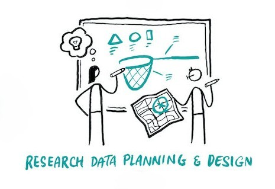

# Planning for Stage 2: Research Data & Design 
<center>

<p style="font-size: x-small;"><em>Adapted from "Project Cycle" by Scriberia, <a href="http://doi.org/10.5281/zenodo.3332807" target="_blank"> The Turing Way Community </a> is licensed under <a href="http://creativecommons.org/licenses/by/4.0" target="_blank"> CC BY 4.0</a></em></p> 
</center>

**Planning for Research Data & Design:** Once you know what data you'll be working with, the next decisions are where the data will live and in what format(s). The guiding questions for this stage are focused on storage and file format choices. The goal is to protect the research data from loss and keep the data usable by you and others in the future. 


## Data storage
> _**Key question:** Where will the data be stored?_

By intentionally planning for storage, you can safeguard your research project against data disasters.   
  
:::{figure} graphics/DMP_storage.jpg
:alt: Good thing I had a plan! The data is all backed up.
:width: 400px

"Data Management Plan" by Scriberia,  The Turing Way Community  is licensed under  CC BY 4.0
:::
  

### Storage criteria

Secure storage protects you against data loss and protects the research data from security breaches or leaks. When you choose a storage solution, you should ask: 

- Is the storage platform appropriate to the **size or volume of the data** that you plan to collect? For example, you'll need to pay attention to storage space if you are working with collections of high- speed video files.  

- Does the storage platform match the **degree of sensitivity** of the data (e.g. personal data)? 

- If you are working with proprietary data, where are you **permitted** to store the data? (The graduation agreement/user agreement will specify.)  

- Does the storage platform store data **within the EU**? (It is strongly recommended.)  

- Will you need to share the data with **collaborators** during your project?  

We recommend that you discuss where the data should be saved with your thesis supervisor during the planning phase of your thesis project. No matter which storage solution you use, you need to share the folder with your supervisor. 
  

### Storage solutions for MSc students at TU Delft:

This is an overview of recommended storage platforms for master’s students at TU Delft. Here, we will give a short description of key features, plus links to more detailed information:    

::::{tab-set}

:::{tab-item} OneDrive 
- OneDrive folders containing the research data for your project should be shared with your supervisor(s). 

- You can set up a desktop version of OneDrive to back up the files on your device.     

- Your OneDrive storage will be deleted once you are no longer part of TU Delft, make sure you transfer the data that you or your supervisor wants to keep at the end of the project, otherwise it will be deleted.
  
- [Learn more about OneDrive storage at TU Delft.](https://storagefinder.tudelft.nl/package/6/)
:::

:::{tab-item} Microsoft Teams
- Teams files are stored on 'Sharepoint', and can sync with OneDrive 

- Teams can be an option for collaborative projects (unless the data are sensitive), but you need to be aware of which sharing permissions are enabled for Teams folders:  

- If the creator of a folder has allowed anyone to access it, that could lead to a data breach.  

- If the creator of a folder has allowed universal or public editing rights, your data could accidentally get erased or deleted.    

- Your Sharepoint storage will be deleted once you are no longer part of TU Delft: make sure you transfer the data that you or your supervisor wants to keep at the end of the project, otherwise it will be deleted.

- [Learn more about Microsoft Teams at TU Delft.](https://storagefinder.tudelft.nl/package/9/)
:::

:::{tab-item} Git
- Git is recommended for storing and working on code.
  
- Examples of Git repositories are GitLab, GitHub, Codeberg, TU Delft Gitlab. Check with your supervisor if they have an existing Git repository they prefer you to use. 
:::

:::{tab-item} Project Data Drive (U:) 
- MSc thesis supervisors must request access to the SURF Drive on behalf of their students.

- [Learn more about the Project Data Drive at TU Delft.](https://storagefinder.tudelft.nl/package/2/)
::: 

:::{tab-item} Other 
* There are also storage solutions that are specific to lab groups or consortiums (e.g. the M: or N: drive or a faculty-specific server). You can ask your supervisor more about this. 
:::
::::

### NOT recommended for storage 

- Commercial third-party cloud storage such as Dropbox and Google Drive: avoid storing data on personal (non-TU Delft) accounts such as these, particularly personal data. Cloud applications such as Google and Dropbox store data outside the European Union where EU privacy regulations are not enforced, thus are not approved by TU Delft.   

- Portable drives such as hard drives and thumb drives: it’s too easy for these to get lost or fall into the wrong hands.   

- Floating on your personal computer without backups to the TU Delft server.
  

## Format
> _**Key question:** In which file format(s) will the data be saved?_
Carefully planning ahead for file formats helps to ensure:  
- **Ample storage:** By thinking ahead, you’ll be able to plan enough storage for the data. For example, a collection of mp4s or a large series of high-resolution images may require significant storage space.
- **Interoperability:** This means that other people can open the data files across different digital platforms. For example, an image saved in .psd format can only be opened by someone who has a license to Photoshop, but an image saved as a .jpg is interoperable because it can generally be opened across platforms. Interoperability should be a goal, but only if the data fits the requirements to be openly shared: legal and ethical guidelines sometimes limit or prohibit the open sharing of certain categories of personal, proprietary, or copyrighted data.
- **Re-usability:** By choosing formats that are commonly accepted in your field and by avoiding formats tied to proprietary platforms, it will make the raw data more open for anyone who wants to re-use the data to reproduce your results.    

 

### Preferred file formats 
DANS, the Dutch national centre of expertise and repository for research data, explains that preferred file formats have these key characteristics:  
:::{card} 
1. The file format can be read in free software, so it is not dependent on vendors.  

2. The data format has “open specifications", which means it's well-documented and the documentation is openly available. 

3. The file format is frequently used by researchers in general or within your research discipline.  

*For more information about preferred file formats, visit [DANS' website.](https://dans.knaw.nl/en/file-formats/) 
(DANS, 2025) 
:::

This graphic shows general examples of data formats researchers often use (you can click on the image to enlarge it). We recommend asking your supervisor to help you identify the standard file formats used in your particular field of research: 
  
:::{figure} graphics/file_formats.jpg
:alt: Types of Research Data we can help to organise and share.
:width: 400px

## Re-visit the Checklist 

```{admonition} Open the checklist and add notes about your project under Stage 2:  
:class: tip
- Add details about your project: amount of storage, sensitivity of the data, and collaborators.
- Add check marks in the checkboxes to indicate which storage solution(s) best fit your project.
- Add details about which file formats will be used in your project. 
- Indicate whether these file formats are interoperable by checking the boxes. 
- Scan back through Section II of the mini-module. Add notes with key takeaways about storage options and/or formatting. Focus on capturing the details that apply to your project.  
```  
## Stage 2: Check your understanding 
Check your understanding of key ideas in Stage 2: Planning for Research Data & Design by answering these quiz questions: 
  
```{h5p} https://tudelft.h5p.com/content/1292947761719805577
```

 

