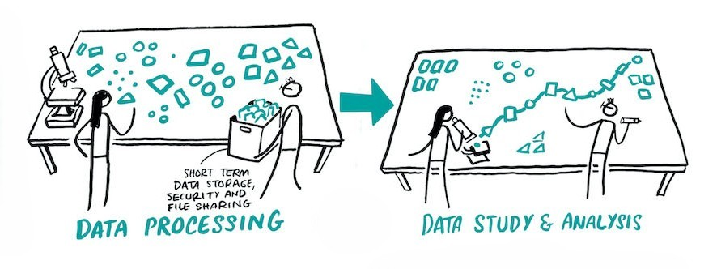

# Stage 4: Data Processing, Study & Analysis 
<center>

<p style="font-size: x-small;"><em>Adapted from "Project Cycle" by Scriberia, <a href="http://doi.org/10.5281/zenodo.3332807" target="_blank"> The Turing Way Community </a> is licensed under <a href="http://creativecommons.org/licenses/by/4.0" target="_blank"> CC BY 4.0</a></em></p> 
</center>

**Planning for Data Processing, Study & Analysis:** The guiding questions for this stage focus on protecting the raw data, keeping units and formats consistent, and maintaining a clear, reproducible link between the research data, your analysis, and your results. 

## Separate raw data 
> _**Key question:** How will you distinguish between raw vs. processed data?_

It's recommended to save the **raw data** for your project **in one folder** and the **processed data in another, separate folder**. That way, nobody can accidentally alter or delete the raw data. Some key best practices include: 

- Save a complete copy of the raw data set and adjust the file settings to make it **read-only**.  

- Use folder and file naming conventions to help you distinguish clearly between the raw and processed data.
  

## Units
> _**Key question:** What units will the data be collected in?_
- In most research fields, **numbers mean nothing without units**. Therefore, it's important to include International System of Units (SI units) of the modern metric system while you are collecting research data.
  
- Be aware of **date formats** as these can differ internationally and lead to confusion. For example, what date is 01-02-20?

- **Punctuation also matters!** For example, some programming platforms cannot accurately read commas as a decimal separator. You can imagine what a headache it would create if you were trying to work with a very large dataset and had to replace every instance of a comma with a period. Therefore, it's good to be aware of it.
  

## Transparency: Linking data and results
> _**Key question:** How will you maintain a clear link between the data, your analysis method, and your results?_

To ensure a reproducible and transparent research workflow, you will need to be able to show which data (collected under which conditions) you analysed, and in which ways. And you'll need to be able to point back to which analyses led to each result/finding that you include in your final report. This means that in addition to documenting the specific conditions under which the data was collected, you need to **provide documentation for your process of analysis**. Your supervisor should be able to follow what you plotted in your report back to the documentation for processing, then back to the raw datasets that were used. For example, if you included a figure in your report, you should provide access to the original file(s) used to make that figure (e.g. in a folder of supporting research objects).    

### Scenario 
This scenario illustrates tracking data collection and outputs:  

```{admonition} Documentation Scenario: Electronic lab notebook 
:class: tip
A researcher investigates the effect of microplastic concentrations on aquatic plant growth through two controlled experiments: one exposing plants to low microplastic concentrations and another to high microplastic concentrations. During data collection, the researcher carefully documents each step in an electronic lab notebook, recording:  

The general experimental protocol that was used, including information on  

- Experimental conditions such as water temperature, pH levels, and light exposure 

- Dosage and timing of microplastic additions, type of microplastic used (Chemical name & distributor) 

- Plant growth measurements (e.g., root length, chlorophyll concentration) at defined intervals 

- Sample-IDs, Plant-strain (if different plants are used in the project) 

- Deviations from the protocol, unexpected observations, or equipment issues that may affect data integrity 

 
Next, the researcher analyses the data by using Python to run a statistical growth model on each dataset. To ensure traceability between the model outputs and their source data, the researcher applies a systematic file naming convention that encodes the experiment condition, date, and version, for example:  

- model_low_concentration_YYYYMMDD_v1.pkl 

- model_high_concentration_YYYYMMDD_v1.pkl 

The electronic lab notebook is used to document the code inputs and outputs, including model parameters, goodness-of-fit statistics, and any runtime warnings – alongside notes on decisions made during the analysis, such as outlier removal or parameter adjustments. This ensures the full analytical workflow is transparent and reproducible.  
```  
```{admonition} Include documentation with your final report
:class: warning
A summary of the final results (including key graphs and data) can be included with your final report to aid interpretation, facilitate review, and provide a concise record of the experiment's outcomes. This enables you and your supervisor to quickly understand the key findings without needing to revisit the full analysis workflow, while maintaining clear links to the underlying data and model outputs.
```
:::{dropdown} Additional resources for documenting analysis
Here are several tools that can be used to connect data analysis directly to the final output figures (and thesis text). These tools support reproducible research by ensuring that figures and outputs are generated directly from the underlying data analysis, reducing errors and improving transparency.  

**Markdown documents** let you combine descriptive text with executable R code (which is often used in statistics). Plain-text Markdown documents contain embedded R code chunks that generate tables, figures, and results directly within the document. This makes it easier to document your analysis procedure.
- ["Introduction to R Markdown"](https://rmarkdown.rstudio.com/articles_intro.html) 

- ["R Markdown: The Definitive Guide"](https://pkg.yihui.org/rmarkdown-book/) 
  

**Jupyter Notebook** is an open-source web application that combines live python code, equations, visualizations, and explanatory text in a single document.  

- [Jupyter Notebook beginner guide](https://jupyter-notebook-beginner-guide.readthedocs.io/en/latest/what_is_jupyter.html) 

- [Jupyter Notebook Training](https://github.com/burkesquires/jupyter_training)
  
- A TU Delft project, [JBOSS](https://jboss.tudelft.nl), lets you integrate your analysis, documentation, and writing through Jupyter Book and Git, enabling seamless connections between code, results, and manuscript preparation. It allows you to write your thesis, including your analysis and present it as your final report - where it automatically generates a pdf of your thesis (via Latex). 

```{video} https://www.youtube.com/embed/UDREanmF0qE?si=8nbp13aV3vXhg_x9
```

- [TU Delft Starter Kit Quickstart](https://tud-jb-os.github.io/starterkit/quickstart/) 
  
*Note: The TU Delft Starter Kit is in project form.
:::
  

## Reducing data leaks
> _**Key question:** How will you reduce risks of data leaks?_

While working with research data, you should take the following extra safety precautions: 
:::{card} 
1. Have a password on your computer. 

2. Lock your computer when you’re not working on it. 

3. Wear headphones if you listen to interviews in a public space. 

4. Check that access to the data is restricted to only those who should have it,and they have the appropriate access rights. 

5. If working with human participants, pseudonymise or anonymise your data whenever possible. 

6. When transferring data, use the safe facilities recommended by your university. Don’t use options like Google Drive, Dropbox, or WeTransfer.  

7. If you lose any of your data (e.g., lost USB stick or hard drive, or a stolen laptop) report this to your supervisor immediately! It may be a data breach.
   
(Li et al., 2025a)
:::

## Revisit the Checklist 

```{admonition} Open the checklist and add notes about your project under Stage 4:  
:class: tip
- Add details about your planned research methods: describe in detail how you will collect the data. 
- Add details about which documentation strategies you plan to use. 
- Add details about your planned file naming schema and folder structures. 
- If applicable, describe how you will do version control.  
- Scan back through Section IV of the mini-module. Add notes with key takeaways about protecting the raw data, consistency of units, and documenting the link between the research data, your analysis, and your results. Focus on capturing the details that apply to your project.  
``` 
## Check your Understanding 

Check your understanding of key ideas in Stage 4: Planning for Data Processing & Analysis by answering these quiz questions: 
  
```{h5p} https://tudelft.h5p.com/content/1292956541158079777
```
  


