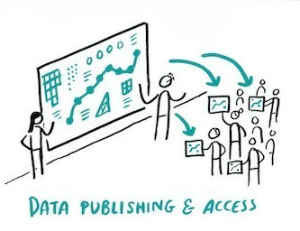
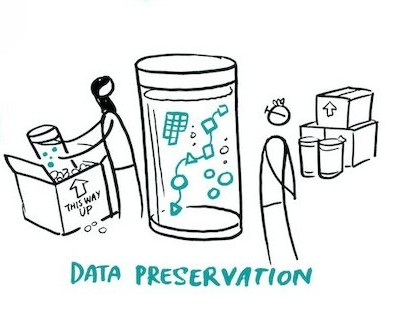
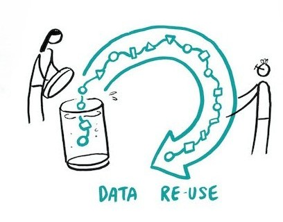

# Stage 5: Data Publishing & Access, Preservation & Re-use 

<div style="display: flex; gap: 10px;">
  
  
  
</div>

<center>
<p style="font-size: x-small;"><em>Adapted from "Project Cycle" by Scriberia, <a href="http://doi.org/10.5281/zenodo.3332807" target="_blank"> The Turing Way Community </a> is licensed under <a href="http://creativecommons.org/licenses/by/4.0" target="_blank"> CC BY 4.0</a></em></p> 
</center>

**Planning for Data Publishing & Access, Preservation & Re-use:** As your project wraps up, the guiding questions for this final stage focus on what happens to the research data next: what should be shared, archived, or deleted, how to document it for others, where it should live long-term, and how it should be licensed. 

## Sharing data
> _**Key question:** Which project data can be shared publicly, archived internally, or deleted?_ 

Your plan for the project data should be based on conversations with your supervisor: we encourage you to confirm with your supervisor what should be kept, deleted and published. 


## Documentation 
> _**Key question:** What supporting documents are necessary to make the data and code understandable and re-usable by others?_

The supporting documentation should provide enough context for others to understand, verify, and re-use the research data and code. This includes clear descriptions of the dataset, variables, file organization, data collection and processing methods, code functionality, software and package requirements, and instructions for reproducing the analysis.

Careful documentation makes your research process **transparent**, your results **reproducible**, and the research data **re-usable** by others. Therefore, your documentation should be included along with the final report.  

### How to disclose AI Use 
As part of the documentation that you include for your final report, it's also recommended disclose your use of AI. 

Examples: 
- If you used **generative AI** to create a diagram, it's recommended to disclose this use and share the specific generative AI platform and prompt that you used.
- If you used **generative AI** to generate code/scripts to process or analyse the data.
- If you used **generative AI** to process or analyse the data.
  
- If you used an **internally-developed AI tool**, your report should explicitly describe the AI model, including its name and version, source (if publicly available), key properties and capabilities, training data (where known), intended purpose, and any important limitations. The report should also explain how the tool was used in the research, including the inputs provided, outputs generated, parameter settings or configurations, any fine-tuning or customizations, validation methods, and the extent of human oversight. This documentation enables others to understand, evaluate, and, where possible, reproduce the role of the AI tool in the research process.

```{admonition} Important Note: 
:class: warning
Discuss with your supervisor if/what AI use is allowed for your respective program. We also suggest you visit this <a href="https://tu-delft-library.github.io/il-master-thesis-guide/main/5b-specifying-ai-use.html" target="_blank">IL Master Thesis Guide</a> which discusses more about how to specify AI use. 
```


## Data storage after project
> _**Key questions:** Which repository is appropriate for long-term storage? Where will the research data and code for your project be saved after you complete your final report?_

Some MSc students contribute to scientific publications. If this is you, you need to archive the research data and code from your project in a **repository** at the latest by the time the research publication is published (unless the data/code  cannot be shared due to ethical or legal limitations). A repository is a storage platform that serves as a central location for preserving and sharing research objects (data, code, methods) so others can re-use these. Discuss with your supervisor whether you should upload the data/code to a repository at the end of your master project, or whether you should hand your supervisor the data/code so that they can upload the data once the paper is published. This approach can prevent others from scooping your findings.  

Even if you do not contribute to scientific publications, you can share the data/code for your project in a data repository. However, you are not obligated to do so. If you're interested in sharing the data and code in a repository, please also discuss this with your supervisor. 

:::{dropdown} General repositories
You can save the research data and code for your project in one of these general (not field or discipline-specific) open repositories:   

- [Zenodo](https://zenodo.org/)

- [4TU.ResearchData](https://community.data.4tu.nl/)

- [DANS](https://dans.knaw.nl/en/)
:::

:::{dropdown} Field-specific repositories
You can use these repository finders to find an open repository that is specific to your field of research:  

- [Commons.datacite.org](https://commons.datacite.org/repositories)

- [Fairsharing.org](https://fairsharing.org/)

- [Re3data.org](https://www.re3data.org/)
:::


### DOI or another unique identifier 
Whether you choose to save the data and code in a general or more specialized repository, check that the repository assigns a **digital object identifier (DOI) or other unique identifier** to the dataset/code that makes it more **findable**. Refer to the data set/code using the DOI or other unique identifier in your thesis (and publication, if applicable). This makes it easier for others to find the research data/code.  

 ### Sharing Code

Even if you share your code in public Git repositories, you should also archive your code in a data repository (next to having it on the Git repository), and reference it in your thesis using the assigned DOI.  Reasons to do this include:   

1. This keeps a snapshot of the code you used, so others can use exactly the same version as you did in your thesis.  

2. This assigns a DOI to your code, giving it a permanent reference (unlike webpage links that can break). 

3. This ensures that the code will be available for 10+ years.

### Metadata

When you upload the data/code to a repository, you'll be prompted to add metadata. **Metadata is information about the data** set(s) you've uploaded, such as *provenance* (where/who the data came from) and key characteristics like size and format. Metadata is formatted so that it is machine-readable. This means that repositories and search engines can automatically index, catalogue, and surface your dataset — making it easier for others (and your future self) to find and understand it without opening the file itself.. Adding complete metadata **increases the findability** of the datasets.   
  

## Licensing
> _**Key question:** How will you license the data collected for your project?_

This question is particularly applicable for students who are generating code as part of their projects. MSc students at TU Delft are owners of the research data for their projects and their code, unless they sign a statement giving away their ownership. Make sure your code has a clear license and mark this license in your Git environment. If you are doing an internship or collaboration with a company, you need to verify whether you have permission to copyright the data by checking your graduation agreement. 


### Additional resources for licensing  

- We suggest that you refer back to section in this mini-module about [Copyrighted Data](https://tu-delft-library.github.io/planning_for_rdm/main/stage_1.html#copyrighted-data-intellectual-property)

- [CC Licenses](https://foter.com/blog/how-to-attribute-creative-commons-photos/)

- [TU Delft guide on software licensing](https://tu-delft-dcc.github.io/docs/software/documentation/license.html)

- TU Delft Library Copyright Checkpoint: [As a student, I want to choose a license for my multimedia/student paper, thesis, data, etc.](https://www.tudelft.nl/library/support/copyright/student-copyright-answers#c1118723)

## Revisit the Checklist 

```{admonition} Open the checklist and add notes about your project under Stage 3:  
:class: tip
- Add questions you may have for your supervisor about what data to keep/what to delete.  
- Add questions you may have for your supervisor about which supporting documentation you should submit with your final report. 
- Add details about your planned file naming schema and folder structures. 
- If you are publishing your work, thus uploading to a repository, check the boxes to indicate what type of repository. Underneath the check box, add the name of the repository.
- Describe how you will license the data for your thesis project (or use this space to add questions you may have for your supervisor).  
- Scan back through Section V of the mini-module. Add notes with key takeaways about preserving data when your project is complete, supporting documentation, repository options, and licensing. Focus on capturing the details that apply to your project.  
```

## Check your understanding
Check your understanding of key ideas in Stage 5: Planning for Data Publishing, Preservation & Re-Use by answering these quiz questions: 
  
```{h5p} https://tudelft.h5p.com/content/1292956548357730237
```
  


